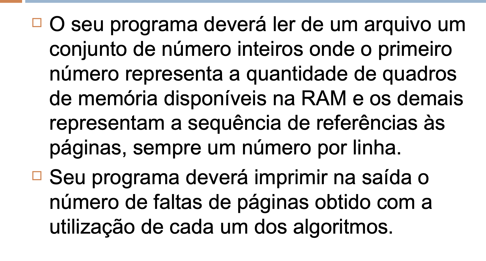
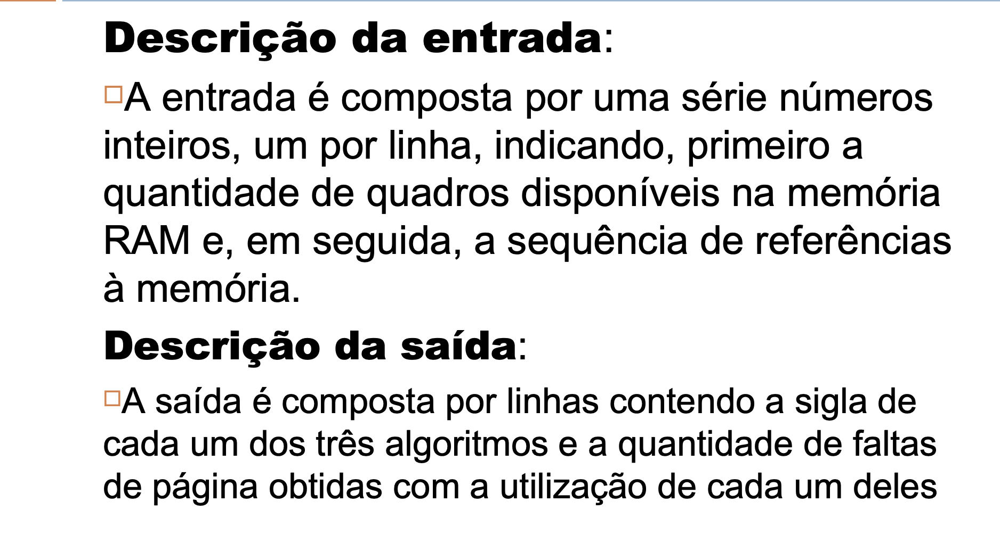
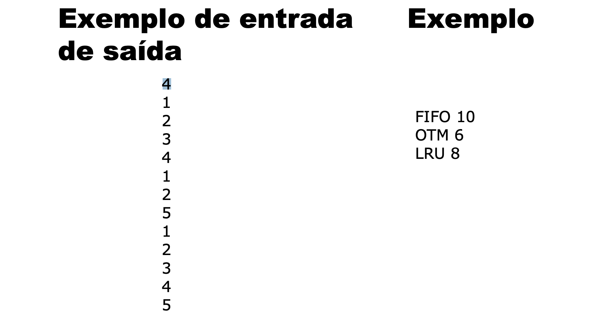

# paging_on_demand algorithms

### Project for O.S. discipline
#### Fifo (First In First Out)
#### OTM (Otimum algorithm, used for reference)
#### LRU (Least Recently Used)
 





- <https://sig-arq.ufpb.br/arquivos/202314517544c35741167ee0bedb4f539/Trabalho02.pdf>

## How to run

- At root folder, run:

```bash
python3 app/main.py
```

- Repository: < <https://github.com/michellavezzo/paging_on_demand> >
